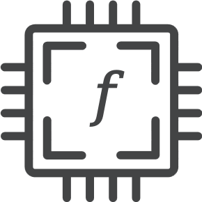

<div align="center">
  
  <h1>f-mesh</h1>
  <p>Flow Based Programming inspired framework in Go</p>
  <p><a href="https://jpaulm.github.io/fbp/">Learn more about FBP</a> (originally discovered by @jpaulm)</p>
</div>

<h1>What is it?</h1>
<p>F-Mesh is a functions orchestrator inspired by FBP. 
It allows you to express your program as a mesh of interconnected components (or more formally as a computational graph).
</p>
<h3>Main concepts:</h3>
<ul>
<li>F-Mesh consists of multiple <b>Components</b> - the main building blocks</li>
<li>Components have unlimited number of input and output <b>Ports</b></li>
<li>Any output port can be connected to any input port via <b>Pipes</b></li>
<li>Ports and pipes are type agnostic, any data can be transferred to any port</li>
<li>The framework works in discrete time, not it wall time. The quant of time is 1 activation cycle, which gives you "logical parallelism" out of the box (activation function is running in "frozen time")</li>
</ul>

<h1>What it is not?</h1>
<p>F-mesh is not a classical FBP implementation, it does not support long-running components or wall-time events (like timers and tickers)</p>


<h2>Example:</h2>

```go
fm := fmesh.New("hello world").
		WithComponents(
			component.New("concat").
				WithInputs("i1", "i2").
				WithOutputs("res").
				WithActivationFunc(func(inputs *port.Collection, outputs *port.Collection) error {
					word1 := inputs.ByName("i1").FirstSignalPayloadOrDefault("").(string)
					word2 := inputs.ByName("i2").FirstSignalPayloadOrDefault("").(string)

					outputs.ByName("res").PutSignals(signal.New(word1 + word2))
					return nil
				}),
			component.New("case").
				WithInputs("i1").
				WithOutputs("res").
				WithActivationFunc(func(inputs *port.Collection, outputs *port.Collection) error {
					inputString := inputs.ByName("i1").FirstSignalPayloadOrDefault("").(string)

					outputs.ByName("res").PutSignals(signal.New(strings.ToTitle(inputString)))
					return nil
				})).
		WithConfig(fmesh.Config{
			ErrorHandlingStrategy: fmesh.StopOnFirstErrorOrPanic,
			CyclesLimit:           10,
		})

	fm.Components().ByName("concat").Outputs().ByName("res").PipeTo(
		fm.Components().ByName("case").Inputs().ByName("i1"),
	)

	// Init inputs
	fm.Components().ByName("concat").InputByName("i1").PutSignals(signal.New("hello "))
	fm.Components().ByName("concat").InputByName("i2").PutSignals(signal.New("world !"))

	// Run the mesh
	_, err := fm.Run()

	// Check for errors
	if err != nil {
		fmt.Println("F-Mesh returned an error")
		os.Exit(1)
	}

	//Extract results
	results := fm.Components().ByName("case").OutputByName("res").FirstSignalPayloadOrNil()
	fmt.Printf("Result is : %v", results)
```
See more in [examples](https://github.com/hovsep/fmesh/tree/main/examples) directory.
<h2>Version 0.1.0 coming soon</h2>
