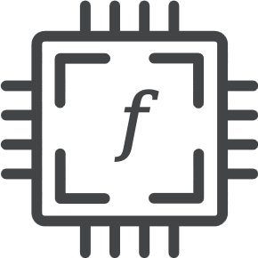

<div align="center">
  
  <h1>F-Mesh</h1>
  <p><em>Flow-Based Programming framework for Go</em></p>
	
[](https://goreportcard.com/report/github.com/hovsep/fmesh)
[](https://pkg.go.dev/github.com/hovsep/fmesh)
[](https://github.com/hovsep/fmesh/releases/latest)
[](https://opensource.org/licenses/MIT)
[](https://codecov.io/gh/hovsep/fmesh)
</div>
---

## What is F-Mesh?

F-Mesh is a **Flow-Based Programming (FBP)** framework that lets you build applications as a graph of independent, reusable components. Think of it as connecting building blocks with pipes - data flows through your program like water through a network of connected components.

Inspired by [J. Paul Morrison's FBP](https://jpaulm.github.io/fbp/), F-Mesh brings the power of dataflow programming to Go with a clean, type-safe API.


---

## Installation

```bash
go get github.com/hovsep/fmesh
```

---

## Quick Start

Here's a simple mesh that concatenates two strings and converts them to uppercase:

```go
package main

import (
	"fmt"
	"os"
	"strings"

	"github.com/hovsep/fmesh"
	"github.com/hovsep/fmesh/component"
	"github.com/hovsep/fmesh/signal"
)

func main() {
	if err := run(); err != nil {
		fmt.Println("Error:", err)
		os.Exit(1)
	}
}

func run() error {
	// Create the components
	concat, err := component.New("concat",
		component.WithInputs("i1", "i2"),
		component.WithOutputs("res"),
		component.WithActivationFunc(func(this *component.Component) error {
			word1 := this.InputByName("i1").Signals().FirstPayloadOrDefault("").(string)
			word2 := this.InputByName("i2").Signals().FirstPayloadOrDefault("").(string)
			return this.OutputByName("res").PutSignals(signal.New(word1 + word2))
		}))
	if err != nil {
		return err
	}

	uppercase, err := component.New("uppercase",
		component.WithInputs("i1"),
		component.WithOutputs("res"),
		component.WithActivationFunc(func(this *component.Component) error {
			str := this.InputByName("i1").Signals().FirstPayloadOrDefault("").(string)
			return this.OutputByName("res").PutSignals(signal.New(strings.ToUpper(str)))
		}))
	if err != nil {
		return err
	}

	// Create the mesh
	fm, err := fmesh.New("hello world")
	if err != nil {
		return err
	}
	if err = fm.AddComponents(concat, uppercase); err != nil {
		return err
	}

	// Connect components via a pipe
	if err = concat.OutputByName("res").PipeTo(uppercase.InputByName("i1")); err != nil {
		return err
	}

	// Set initial inputs
	if err = concat.InputByName("i1").PutSignals(signal.New("hello ")); err != nil {
		return err
	}
	if err = concat.InputByName("i2").PutSignals(signal.New("world!")); err != nil {
		return err
	}

	// Run the mesh
	if _, err = fm.Run(); err != nil {
		return err
	}

	// Get the result
	result, err := uppercase.OutputByName("res").Signals().FirstPayload()
	if err != nil {
		return err
	}
	fmt.Printf("Result: %v\n", result) // Result: HELLO WORLD!
	return nil
}
```

---

## Key Features

### **Component-Based Architecture**
Build complex workflows from simple, reusable components. Each component is independent and testable.

### **Hooks System**
Extend behavior at any execution point - mesh lifecycle, cycles, component activations, and port operations:

```go
fm.SetupHooks(func(h *fmesh.Hooks) {
    h.BeforeRun(func(fm *fmesh.FMesh) error {
        fmt.Println("Starting mesh...")
        return nil
    })
    h.AfterCycle(func(ctx *fmesh.CycleContext) error {
        fmt.Printf("Cycle #%d complete\n", ctx.Cycle.Number())
        return nil
    })
})
```

### **Runtime Observability**
`Run()` returns a `RuntimeInfo` report with per-cycle activation results and timing — history retention is configurable for long runs.

### **Metadata & Filtering**
Tag signals, components, and ports with labels (string) and scalars (numeric), then filter, route, and aggregate them with consistent collection APIs.

### **Discrete Time Model**
Components activate in cycles (artificial "time"), allowing multiple components to process simultaneously - like lighting multiple lamps at once.

### **Simple, Predictable API**
Fluent, consistent interfaces with direct error returns — no hidden error state, no surprises.

### **Concurrency Out of the Box**
All components in a single activation cycle run concurrently - no need to manage goroutines or other concurrency primitives yourself.

---

## Core Concepts

| Concept | Description |
|---------|-------------|
| **[Component](https://github.com/hovsep/fmesh/wiki/301.-Component)** | The main building block - has inputs, outputs, and an activation function |
| **[Port](https://github.com/hovsep/fmesh/wiki/302.-Ports)** | Entry/exit points on components. Unlimited inputs and outputs per component |
| **[Pipe](https://github.com/hovsep/fmesh/wiki/303.-Pipes)** | Connects an output port to an input port to transfer data |
| **[Signal](https://github.com/hovsep/fmesh/wiki/201.-Signals)** | Data packets flowing through pipes. Type-agnostic with optional labels |
| **[Cycle](https://github.com/hovsep/fmesh/wiki/401.-Scheduling-rules)** | One "tick" of execution where all ready components activate |

---

## Use Cases

F-Mesh excels at:

- **Data transformation pipelines** - ETL, data processing, format conversion
- **Workflow automation** - Multi-step business processes
- **Computational graphs** - Scientific computing, simulations
- **Game logic** - Entity systems, behavior trees
- **Stream processing** - Event handling, reactive systems
- **Experimental architectures** - Prototyping dataflow designs

---

## Documentation

- **[Wiki](https://github.com/hovsep/fmesh/wiki)** - Full documentation (source lives in [`docs/wiki`](docs/wiki) — edit via PR, it is auto-synced to the wiki)
- **[Examples Repository](https://github.com/hovsep/fmesh-examples)** - Working examples and patterns
- **[Generated Go API](https://hovsep.github.io/fmesh/)** - Searchable, source-linked API reference
- **[API Reference](https://pkg.go.dev/github.com/hovsep/fmesh)** - Complete API docs
- **[Flow-Based Programming](https://jpaulm.github.io/fbp/)** - Learn about FBP (by J. Paul Morrison)
---

## Limitations

F-Mesh is **not** a classical FBP implementation:

- Not suitable for long-running components
- No wall-clock time events (timers, tickers)
- Components execute in discrete cycles, not real-time

For real-time streaming or long-running processes, consider alternatives like traditional FBP systems or message queues.

---

## Contributing

Contributions are welcome! Please:

1. Check existing [issues](https://github.com/hovsep/fmesh/issues) or create a new one
2. Fork the repository
3. Create a feature branch
4. Submit a pull request

---

## License

MIT License - see [LICENSE](LICENSE) file for details.

---

<div align="center">
  <p>Made by <a href="https://github.com/hovsep">@hovsep</a></p>
  <p>Star us on GitHub if you find F-Mesh useful!</p>
</div>
