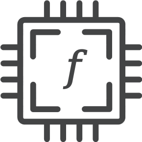

<div align="center">
  
  <h1>F-Mesh</h1>
  <p><em>Flow-Based Programming framework for Go</em></p>
	
[](https://github.com/hovsep/fmesh/actions/workflows/ci.yml)
[](https://pkg.go.dev/github.com/hovsep/fmesh)
[](https://github.com/hovsep/fmesh/releases/latest)
[](https://opensource.org/licenses/MIT)
</div>
---

## What is F-Mesh?

F-Mesh is a **Flow-Based Programming (FBP)** framework for Go. You build an app as a graph of
small, reusable components. Pipes connect them, and data flows through the graph as signals.

It is inspired by [J. Paul Morrison's FBP](https://jpaulm.github.io/fbp/). The API is small and
untyped on purpose: one pipe can carry anything, so you model the flow, not the type graph.


---

## Installation

```bash
go get github.com/hovsep/fmesh
```

Requires Go 1.27 or later.

---

## Quick Start

A mesh that joins two strings and converts the result to uppercase:

```go
package main

import (
	"context"
	"fmt"
	"strings"

	"github.com/hovsep/fmesh"
	"github.com/hovsep/fmesh/component"
	"github.com/hovsep/fmesh/signal"
)

func must(err error) {
	if err != nil {
		panic(err)
	}
}

func main() {
	// Components: named ports plus an activation function
	concat, err := component.New("concat",
		component.WithInputs("i1", "i2"),
		component.WithOutputs("res"),
		component.WithActivationFunc(func(_ context.Context, this *component.Component) error {
			word1 := this.InputByName("i1").Signals().FirstPayloadOrDefault("")
			word2 := this.InputByName("i2").Signals().FirstPayloadOrDefault("")
			return this.OutputByName("res").PutSignals(signal.New(word1 + word2))
		}))
	must(err)

	uppercase, err := component.New("uppercase",
		component.WithInputs("i1"),
		component.WithOutputs("res"),
		component.WithActivationFunc(func(_ context.Context, this *component.Component) error {
			str := this.InputByName("i1").Signals().FirstPayloadOrDefault("")
			return this.OutputByName("res").PutSignals(signal.New(strings.ToUpper(str)))
		}))
	must(err)

	// The mesh holds the components
	fm, err := fmesh.New("hello world")
	must(err)
	must(fm.AddComponents(concat, uppercase))

	// A pipe connects an output to an input
	must(concat.OutputByName("res").PipeTo(uppercase.InputByName("i1")))

	// Seed the inputs, then run until no component has work left
	must(concat.InputByName("i1").PutSignals(signal.New("hello ")))
	must(concat.InputByName("i2").PutSignals(signal.New("world!")))

	_, err = fm.Run(context.Background())
	must(err)

	result, err := uppercase.OutputByName("res").Signals().FirstPayload()
	must(err)
	fmt.Printf("Result: %v\n", result) // Result: HELLO WORLD!
}
```

---

---

## Key Features

- **Components.** Build workflows from small, independent, testable blocks.
- **Concurrency for free.** All components ready in a cycle run at the same time. You write no
  goroutines, channels or locks.
- **Discrete time.** Execution runs in cycles, like ticks of a clock. This makes runs easy to reason about.
- **Deterministic runs.** Same input gives the same output, as long as your activation functions
  are deterministic.
- **Cancellation and deadlines.** `Run(ctx)` passes the context to every activation function and hook.
- **Hooks and plugins.** Add behavior at mesh, cycle, component and port level.
- **Metadata.** Tag signals, components and ports with string or number values, then filter and route by them.
- **Run report.** `Run(ctx)` returns a `RuntimeInfo` with the result of every cycle.

### Hooks

```go
fm.SetupHooks(func(h *fmesh.Hooks) {
    h.BeforeRun(func(ctx context.Context, fm *fmesh.FMesh) error {
        fmt.Println("Starting mesh...")
        return nil
    })
    h.AfterCycle(func(ctx context.Context, hookCtx *fmesh.CycleContext) error {
        fmt.Printf("Cycle #%d complete\n", hookCtx.Cycle.Number())
        return nil
    })
})
```

### Untyped by design

Signals carry `any`. One pipe can hold a string, a struct and an error at once. Go channels cannot
do that. The cost: a type mismatch shows up when you read a payload, not at compile time.

```go
n, err := sig.As[int]()      // reports a mismatch; prefer this
n := sig.PayloadOrDefault(0) // hides a mismatch; use only when a fallback is right
```

### Cancellation and deadlines

A `TimeLimit` becomes a deadline on the run context. So it reaches the HTTP calls and queries
inside your components.

```go
ctx, cancel := context.WithCancel(context.Background())
defer cancel()

component.WithActivationFunc(func(ctx context.Context, this *component.Component) error {
    req, err := http.NewRequestWithContext(ctx, http.MethodGet, url, nil)
    ...
})

_, err := fm.Run(ctx) // errors.Is(err, fmesh.ErrRunCanceled) after cancel()
```

---

## Core Concepts

| Concept | Description |
|---------|-------------|
| **[Component](https://github.com/hovsep/fmesh/wiki/301.-Component)** | The main building block. Has inputs, outputs and an activation function. |
| **[Port](https://github.com/hovsep/fmesh/wiki/302.-Ports)** | An input or output of a component. A component can have any number of them. |
| **[Pipe](https://github.com/hovsep/fmesh/wiki/303.-Pipes)** | Connects an output port to an input port. |
| **[Signal](https://github.com/hovsep/fmesh/wiki/201.-Signals)** | A data packet. Carries any payload plus optional metadata. |
| **[Cycle](https://github.com/hovsep/fmesh/wiki/401.-Scheduling-rules)** | One tick of execution. Every ready component activates. |

---

## Four rules worth knowing up front

Each one surprises people once. The wiki covers them in full.

**1. A component activates only when an input port has signals.** There are no source components.
You start a mesh by putting signals on inputs. If you forget, the run does nothing and returns `nil`.

```go
_ = producer.InputByName("start").PutSignals(signal.New("go")) // without this, nothing happens
```

**2. Order is by name.** Signals keep arrival order within a port. Upstream components drain in
component-name order. A component's ports are traversed in port-name order. So if a component reads
all inputs at once, **port names decide the order**.

**3. Payloads are shared, so treat them as read-only.** Fan-out sends the same `*Signal` to every
destination, and those destinations run concurrently. Never mutate a received map, slice or
pointer; build new signals instead. Run your mesh tests with `-race`.

**4. Cancellation is cooperative.** `Run(ctx)` stops at the next cycle boundary. Go cannot stop a
running goroutine, so an activation function that ignores its context blocks the mesh until it returns.

More: [401. Scheduling rules](https://github.com/hovsep/fmesh/wiki/401.-Scheduling-rules) and
[603. Caveats](https://github.com/hovsep/fmesh/wiki/603.-Caveats).

---

## Use Cases

- **Data pipelines**: ETL, data processing, format conversion
- **Workflow automation**: multi-step business processes
- **Computational graphs**: scientific computing, simulations
- **Game logic**: entity systems, behavior trees
- **Batch event processing**: a bounded set of events, processed to the end
- **Prototyping** dataflow designs

---

## Limitations

F-Mesh is **not** a classical FBP system and **not** a streaming engine. A mesh runs to completion
over the data it was given.

- Not suited to long-running components
- No wall-clock events (timers, tickers)
- Components run in discrete cycles, not in real time
- No backpressure: a mesh holds its signals in memory for the whole run

For real-time streaming, use a classical FBP system or a message queue. Known trade-offs (partial
output before a wait, shared payloads, lost work when one component fails) are listed in
[603. Caveats](https://github.com/hovsep/fmesh/wiki/603.-Caveats).

---

## Documentation

- **[Wiki](https://github.com/hovsep/fmesh/wiki)**: full guide. Source is in [`docs/wiki`](docs/wiki); edit it by PR.
- **[Examples](https://github.com/hovsep/fmesh-examples)**: working programs.
- **[API reference](https://pkg.go.dev/github.com/hovsep/fmesh)**
- **[Flow-Based Programming](https://jpaulm.github.io/fbp/)** by J. Paul Morrison

---

## Versioning

F-Mesh is pre-production. **Minor versions may contain breaking changes** until this notice is
removed. Pin an exact version if that matters to you. [CHANGELOG.md](CHANGELOG.md) lists every
breaking change.

---

## Contributing

Contributions are welcome. Read the [contributing guide](CONTRIBUTING.md) first.

---

## License

MIT. See [LICENSE](LICENSE).

---

<div align="center">
  <p>Made by <a href="https://github.com/hovsep">@hovsep</a></p>
</div>
